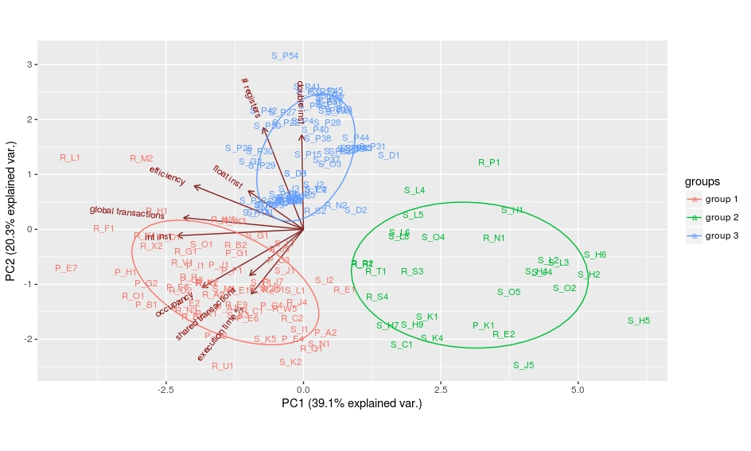

# Pascal architecture GPGPU Benchmark Analysis Results

## Used Benchmarks

* Parboil
* SHOC
* Rodinia

## Environment
* CUDA 8
* Ubuntu 16.04

## Hardware
* Nvidia GTX 1080

## Used libs and language

* R version 3.2.3
* ggbiplot

